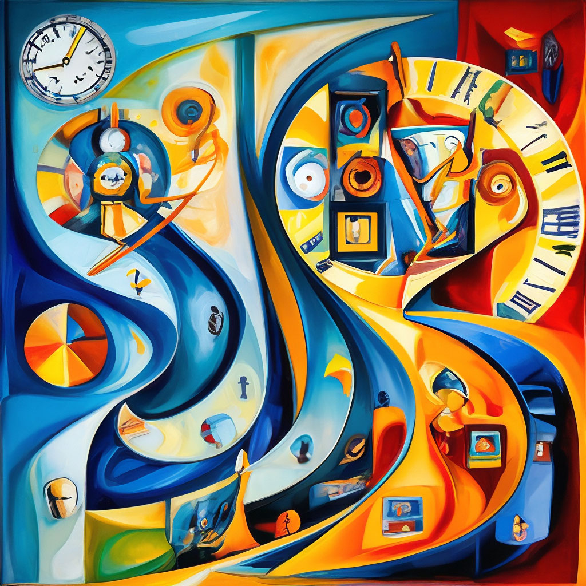
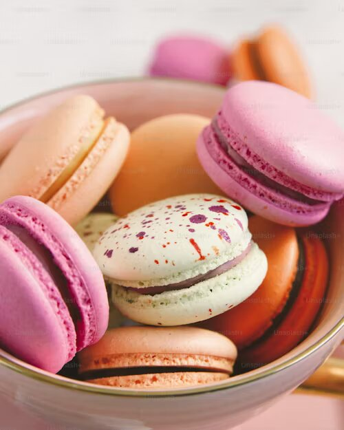
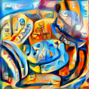

# Домашняя работа 2

- Установите размер изображения равным 512
- Замените нейросеть на VGG-16
- Поменяйте вес вклада стиля и контента, в общую лосс-функцию (например, на 1000 к 1)
- Сгенерируйте собственное NST изображение для выбранных вами входных, контент- и стилевых изображений

## Изображение стиля

## Изображение контента

## Итоговое изображение

